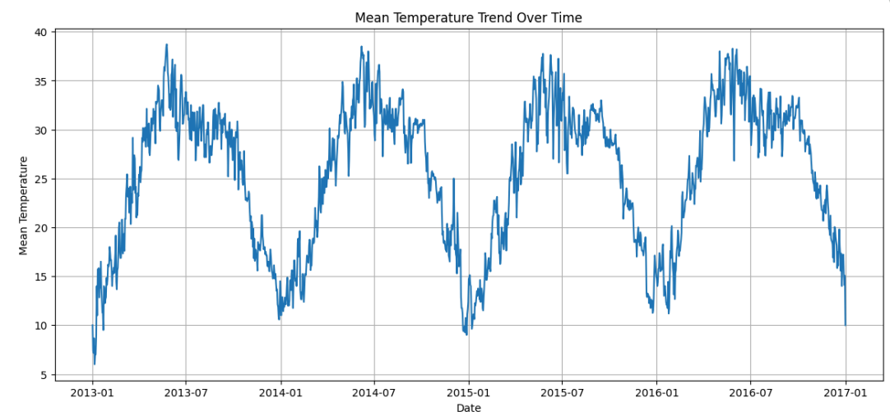
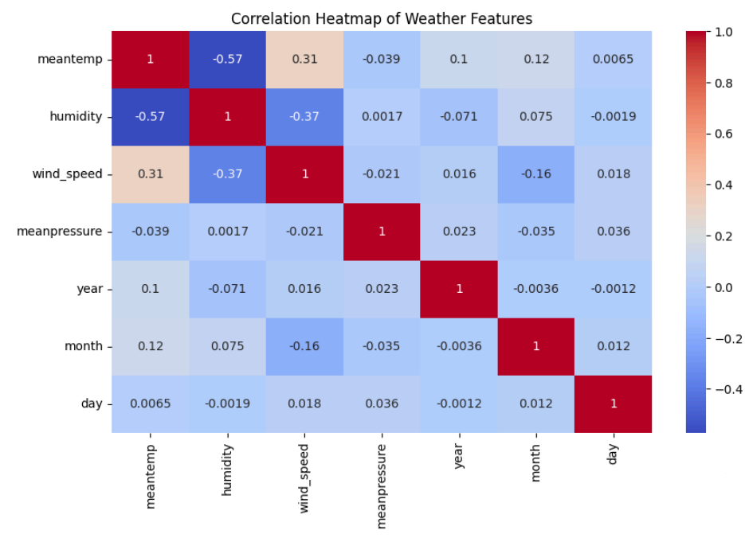
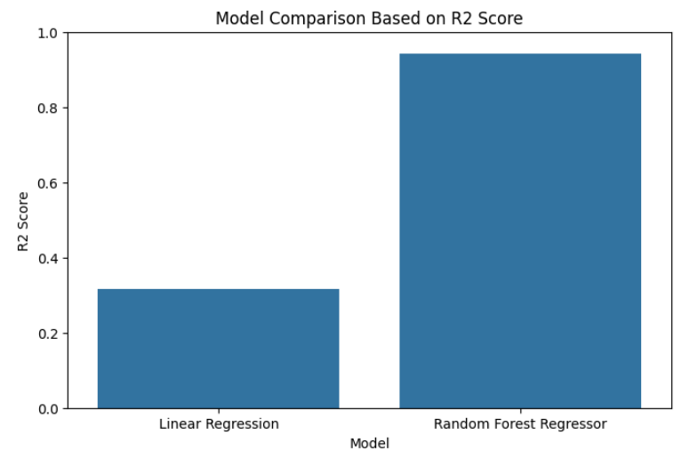
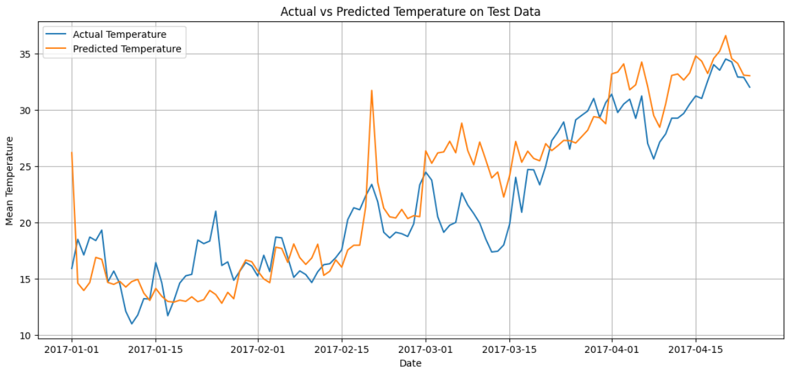

# Weather Data Analysis and Prediction

## Project Overview

Weather Data Analysis and Prediction is a machine learning project that focuses on analyzing historical weather data and predicting mean temperature using weather parameters such as humidity, wind speed, mean pressure, year, month, and day.

The project includes data preprocessing, exploratory data analysis, data visualization, model training, model evaluation, and prediction on test data.

## Internship Project Details

This project was completed as part of my internship at **Codec Technologies**. It is my second internship project after the Twitter Sentiment Analysis project.

- **Internship Organization:** Codec Technologies
- **Project Title:** Weather Data Analysis and Prediction
- **Project Type:** Data Analytics and Machine Learning
- **Internship Project Number:** 2
- **Previous Project:** Twitter Sentiment Analysis
- **Main Focus:** Weather data analysis, visualization, regression modeling, and temperature prediction

## Repository Contents

- `dataset/` - Contains training and testing weather datasets
- `notebook/` - Contains the Google Colab notebook
- `outputs/` - Contains prediction CSV and trained model file
- `assets/` - Contains project visualization images
- `requirements.txt` - Contains required Python libraries

## Objectives

- To analyze historical weather data
- To understand temperature, humidity, wind speed, and pressure trends
- To perform data cleaning and preprocessing
- To visualize weather patterns using charts and graphs
- To build machine learning models for temperature prediction
- To compare model performance using evaluation metrics
- To save prediction results and trained model

## Dataset

The dataset used in this project is the Daily Climate Time Series Data. It contains daily weather records including:

- Date
- Mean Temperature
- Humidity
- Wind Speed
- Mean Pressure

The dataset is divided into training and testing files:

- DailyDelhiClimateTrain.csv
- DailyDelhiClimateTest.csv

## Technologies Used

- Python
- Pandas
- NumPy
- Matplotlib
- Seaborn
- Scikit-learn
- Joblib
- Google Colab

## Project Workflow

1. Import required libraries
2. Load training and testing datasets
3. Understand dataset structure
4. Check missing values and duplicates
5. Convert date column into datetime format
6. Extract year, month, and day from date
7. Perform exploratory data analysis
8. Visualize temperature, humidity, wind speed, and pressure trends
9. Select input features and target variable
10. Train Linear Regression model
11. Train Random Forest Regressor model
12. Evaluate models using MAE, MSE, RMSE, and R2 Score
13. Predict mean temperature on test data
14. Save predictions and trained model

## Machine Learning Models Used

### 1. Linear Regression

Linear Regression was used as a baseline model to understand the linear relationship between weather parameters and mean temperature.

### 2. Random Forest Regressor

Random Forest Regressor was used to improve prediction performance by capturing non-linear relationships in the weather data.

## Evaluation Metrics

The models were evaluated using:

- Mean Absolute Error
- Mean Squared Error
- Root Mean Squared Error
- R2 Score

## Output

The project generates:

- Weather trend visualizations
- Model comparison results
- Predicted mean temperature values
- Saved prediction CSV file
- Saved machine learning model file

## Project Visualizations

### Temperature Trend Over Time

### Correlation Heatmap

### Model Comparison

### Actual vs Predicted Temperature

## Sample Prediction

For a sample input with humidity, wind speed, mean pressure, year, month, and day, the trained Random Forest model predicted the mean temperature successfully.

## Conclusion

This project successfully demonstrates the use of data analysis, visualization, and machine learning techniques for weather prediction. Historical weather data was analyzed to identify patterns and trends. Machine learning models were trained to predict mean temperature, and the Random Forest Regressor performed better due to its ability to capture non-linear relationships.

## Future Scope

- Add rainfall prediction
- Use more advanced time series models
- Build an interactive dashboard using Power BI
- Deploy the model using Streamlit
- Use real-time weather API data for live predictions
